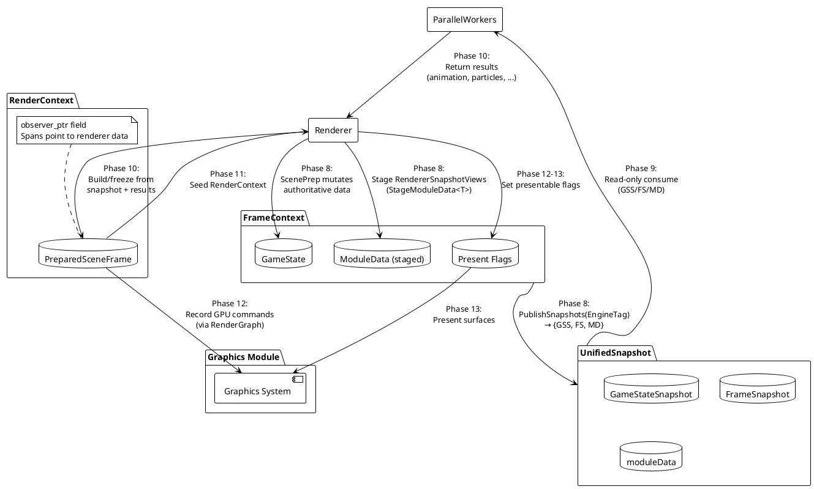
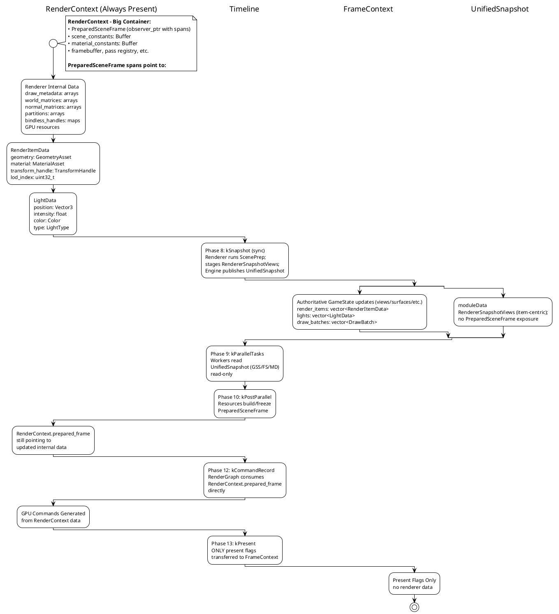
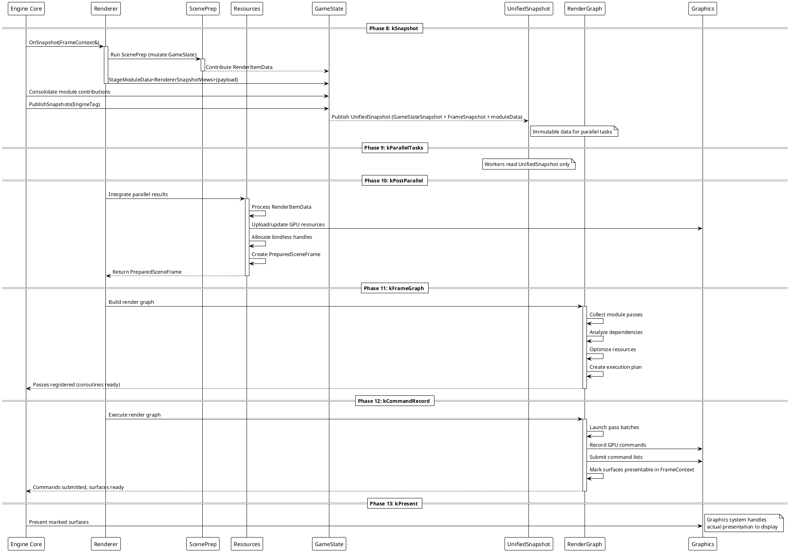
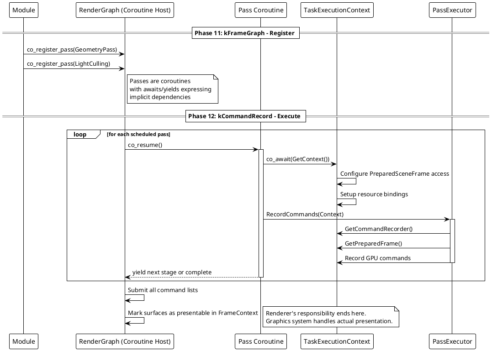
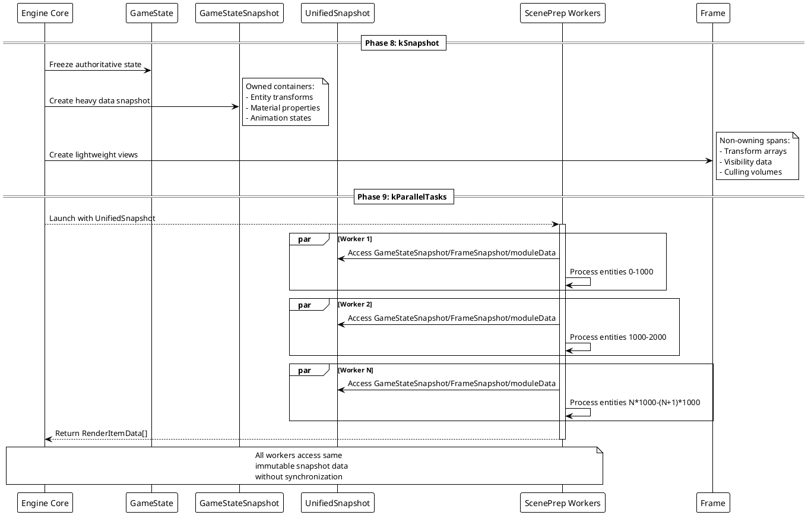
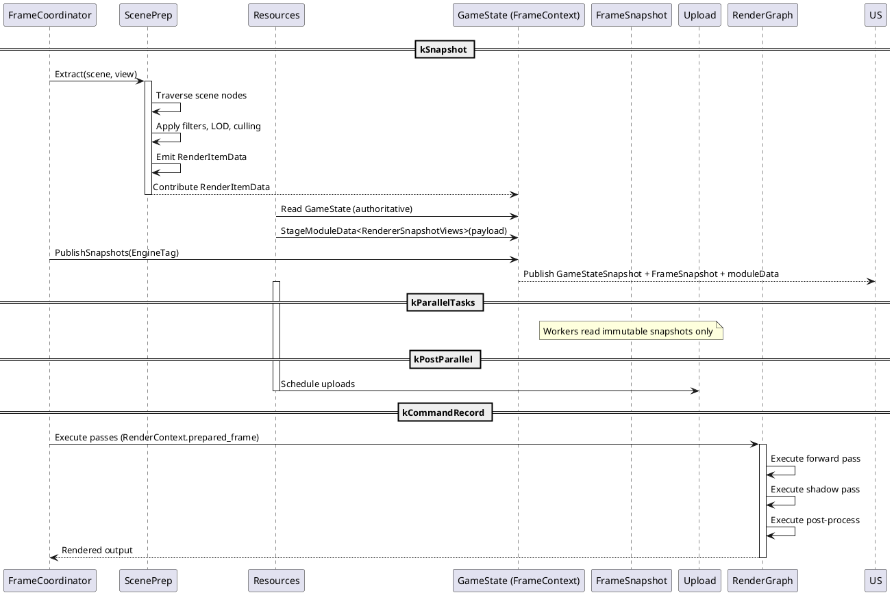
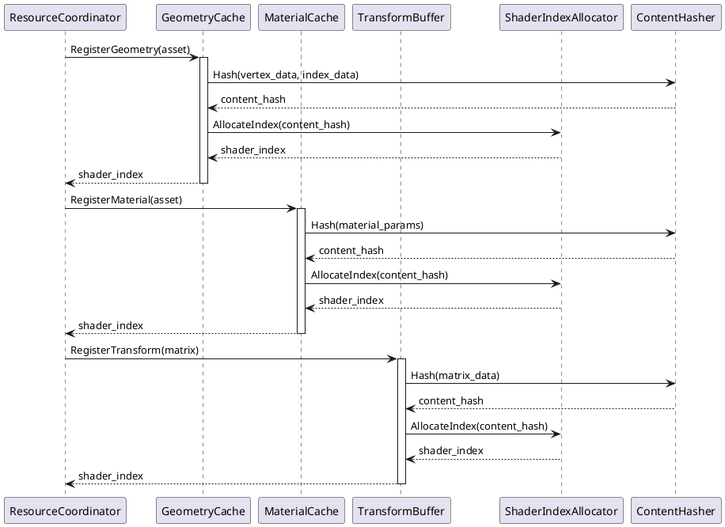

# Oxygen Renderer Architecture Design (Incremental)

## Purpose

This is an incremental, renderer-focused document. It assumes the contracts
and invariants documented in:

- `Core/PhaseRegistry.h` (phase order and semantics)
- `Engine/AsyncEngine.h` (phase orchestration)
- `Engine/FrameContext.h/.cpp` (capabilities, concurrency model, snapshots)

## Renderer participation across phases

- kSnapshot: run ScenePrep; stage typed payloads via `StageModuleData<T>`;
  optionally set views via `SetViews`.
- kParallelTasks: no `FrameContext` access; workers consume the published
  `UnifiedSnapshot` (read-only), including renderer payloads from `moduleData`.
- kPostParallel: integrate results; build/freeze `PreparedSceneFrame`; update
  constants/bindless.
- kFrameGraph / kCommandRecord: seed `RenderContext`, execute passes, and set
  presentable flags via `SetSurfacePresentable`.
- kPresent: graphics reads presentable flags.

### Snapshotting Architecture

The engine's `FrameContext` is the **central coordination mechanism** providing snapshotting for safe parallel access:

**FrameContext** - Central frame execution context with strict access control

- **Access Control Model**: EngineState (engine-internal), GameState (cross-module), `UnifiedSnapshot` (immutable for parallel tasks)
- **Capability-Based Access**: EngineTag tokens restrict critical operations
- **Phase-Dependent Validation**: Operations restricted by execution phase
- **Atomic Snapshot Publication**: Double-buffered `UnifiedSnapshot` with lock-free reader access; engine publishes on the main thread in `kSnapshot` only

**GameStateSnapshot** - Heavy authoritative data (owned containers)

- Scene node transforms, entity hierarchy, **prepared scene data from ScenePrep**
- Material properties, animation states, physics simulation state, audio data
- Obtained only via the `UnifiedSnapshot` returned by `FrameContext::PublishSnapshots(EngineTag)`; there are no global getters for snapshots
- Thread-safe sharing via value semantics inside `UnifiedSnapshot` and internal `shared_ptr` members (e.g., InputSnapshot)

**FrameSnapshot** - Lightweight engine coordination metadata

- Provides identification, timing, budget, execution hints, task group, and validation context
- Parallel tasks receive `UnifiedSnapshot` (which contains both `GameStateSnapshot` and `FrameSnapshot`) from the engine; they never access `FrameContext` directly

Renderer-visible snapshot payloads (this design):

- Use `FrameContext::StageModuleData<T>(...)` during `kSnapshot` (or any phase that allows GameState mutation) to contribute renderer-specific, item-centric views for parallel tasks. The engine moves these into `UnifiedSnapshot.moduleData` at publish time. These payloads are conceptually independent of `PreparedSceneFrame` (CPU-oriented vs GPU/draw-oriented).

### RendererSnapshotViews (typed moduleData payload)

`RendererSnapshotViews` defines the item-centric spans parallel workers need. It’s a typed payload staged into `UnifiedSnapshot.moduleData`; it is NOT a `FrameSnapshot` member.

```cpp
// IsTyped-compliant type with T::ClassTypeId()
struct RendererSnapshotViews /* IsTyped */ {
  // Core item views
  std::span<const TransformHandle> transform_handles;
  std::span<const BoundingSphere>  world_bounding_spheres;
  std::span<const PassMask>        pass_masks;

  // Optional, if finalized pre-snapshot (16 floats per matrix)
  std::span<const float>           world_matrices;
  std::span<const float>           normal_matrices;
};

// In the renderer's kSnapshot handler (main thread):
RendererSnapshotViews views{ /* fill spans from authoritative data */ };
frame_ctx.StageModuleData<RendererSnapshotViews>(std::move(views));

// Engine publishes once per frame during kSnapshot:
auto& unified = frame_ctx.PublishSnapshots(engine_tag);

// In parallel workers (kParallelTasks), read-only access:
if (auto v = unified.moduleData.Get<RendererSnapshotViews>()) {
  const auto& rs = v->get();
  // consume rs.transform_handles, rs.world_bounding_spheres, etc.
}
```

The Renderer stages these payloads in its `kSnapshot` handler. The Engine then consolidates across modules and calls `PublishSnapshots(EngineTag)`, returning the `UnifiedSnapshot` it will hand to parallel workers. Passes later receive `PreparedSceneFrame` via `RenderContext.prepared_frame` (draw-centric GPU-facing data).

**PreparedSceneFrame** - Finalized SoA render data (existing system)

- Immutable spans over renderer-owned arrays
- Per-draw metadata in GPU-facing layout
- World/normal transform matrices indexed by draw
- Partition ranges for different render passes

Publication model in this design (and why it differs from staged snapshot payloads):

- PreparedSceneFrame is draw-centric (GPU/draw commands, deduped matrices in draw order, partitions). It is wired into `RenderContext.prepared_frame` for pass execution.
- Renderer-specific snapshot data is contributed via typed `moduleData` in the `UnifiedSnapshot` and is item-centric and CPU-friendly. It may optionally reference the same matrix storage but does not expose GPU draw metadata.
- During kFrameGraph/kCommandRecord, passes consume `PreparedSceneFrame` only via `RenderContext`. Parallel tasks never rely on renderer GPU draw metadata and never read `FrameContext` directly.

## Module Definitions

### 1. ScenePrep Module - Scene Data Extraction Pipeline

**Location:** `src/Oxygen/Renderer/ScenePrep/`

**Phase Integration:** Executes during `kSnapshot` (synchronous, main thread) as part of snapshot creation process

**Responsibility:** Extract and filter scene data for rendering; then stage typed renderer snapshot payloads via `StageModuleData<T>` for inclusion in the published `UnifiedSnapshot`

**Core Coordinator:**

- **ScenePrepCoordinator** - orchestrates extraction pipeline during snapshot creation

**Worker Components:**

- **EntityExtractor** - extract entities from live scene systems with frustum culling
- **LodSelector** - select appropriate level-of-detail for entities
- **VisibilityTester** - perform occlusion culling and visibility tests
- **RenderItemEmitter** - create `RenderItemData` structures from visible entities
- **MaterialFilter** - apply material-based filtering (transparent, opaque, etc.)
- **SortingWorker** - sort RenderItems by depth, material, etc.

**Input:** `FrameContext&` (engine-coordinated, phase-gated), camera parameters, culling volumes
**Output:** Typed payloads staged via `FrameContext::StageModuleData<T>`, and view definitions via `SetViews` (authoritative GameState)

**Key Principle:** ScenePrep is CRITICAL TO SNAPSHOT CREATION - mutates FrameContext.GameState before PublishSnapshots()

### 2. Resources Module - GPU Resource Management

Location: `src/Oxygen/Renderer/Resources/`

Phase Integration:

- kSnapshot – may finalize item-centric arrays and stage payloads for parallel tasks using `StageModuleData` (no GPU/draw metadata exposure). Engine publishes `UnifiedSnapshot` only in this phase.
- kPostParallel – integrate parallel results and process snapshot data (from the previously published `UnifiedSnapshot`) to build the immutable `PreparedSceneFrame` for this frame.

Responsibility: Manage GPU-facing SoA for the current frame and bindless/bookkeeping using snapshot data and ScenePrep outputs.

Core Coordinator:

- ResourceCoordinator – orchestrates GPU resource lifecycle and handle allocation (part of this design now).

Worker Components (part of this design and grounded by existing systems):

- GeometryUploader – builds per-draw metadata and resource indices from geometry assets (uses `Graphics::ResourceRegistry`).
- MaterialBinder – allocates material slots and updates material buffers (bindless table management policy lives here).
- TransformUploader – batches unique transform uploads and produces deduplicated matrices (aligns with existing `TransformManager`).
- HandleAllocator – versioned/recyclable logical handles for stable indices.
- ResidencyTracker – decides what to (re)upload this frame.
- DescriptorManager – issues descriptor table updates for bindless access.

Inputs: The published `UnifiedSnapshot` (read-only) and ScenePrep staged items; Outputs: updated bindless handles, uploaded buffers, descriptor tables, and the finalized arrays wired into `PreparedSceneFrame`.

Dependencies: `Graphics::ResourceRegistry` for low-level GPU object/view creation.

### 3. RenderGraph Module - Render Pass Execution

Location: `src/Oxygen/Renderer/` (coroutine-based graph)

Phase Integration:

- kFrameGraph – graph assembly (application contributes passes, renderer seeds context)
- kCommandRecord – pass execution and GPU command recording

Execution model (existing, clarified):

- The RenderGraph is a coroutine invoked via `Renderer::ExecuteRenderGraph(RenderContext&)`.
- Passes register themselves in `RenderContext` using `RegisterPass<T>()` so other passes can `GetPass<T>()` for dependencies.
- GPU work is recorded through the renderer/graphics APIs and `ResourceRegistry`.

Render passes (current examples):

- DepthPrePass, ShaderPass, TransparentPass. Additional passes (e.g., Forward/Deferred/Post) can be added following the same pattern.

Input: `RenderContext` with `prepared_frame` (SoA views), `scene_constants`, optional `material_constants`.
Output: Rendered surfaces; passes mark presentable surfaces in `FrameContext`.

Dependencies: `RenderContext` pass registry and `Graphics::ResourceRegistry`.

### 4. Upload Module - Centralized GPU Data Transfers

Location: `src/Oxygen/Renderer/Upload/`

Phase Integration:

- kPostParallel/kPreExecute (renderer-internal): the renderer schedules buffer
  and texture uploads based on what changed this frame.
- kCommandRecord: the renderer retires completed uploads and reclaims staging.

Responsibility: Provide a single, consistent path for uploading GPU data with
batched/coalesced copies, correct post-copy states, and clean lifecycle of
staging resources.

Core Components (implemented for this design):

- UploadCoordinator – front door used by the renderer; supports SubmitBuffer,
  SubmitTexture2D/3D/Cube, and SubmitMany for batching. Flush submits work;
  RetireCompleted reclaims staging.
- UploadPlanner – coalesces adjacent buffer regions; plans texture
  subresource copies, including BC formats.
- UploadTracker – issues tickets/fences; supports coroutine-style waiting and
  failure registration.
- StagingAllocator – persistently mapped staging buffers with alignment
  policy; deferred-unmap safety on teardown.
- UploadPolicy/Diagnostics – alignment and batching knobs; stats reporting.

Integration points (current code):

- Mesh uploads: vertex and index buffers are uploaded via a single SubmitMany
  call per mesh to maximize coalescing.
- Bindless structured buffers: world transforms, material constants, and draw
  metadata are uploaded via SubmitMany (one request each). The helper
  `BindlessStructuredBuffer<T>` is “lean”: `EnsureBufferAndSrv(...)` ensures a
  device-local Storage buffer and registers an SRV; it does not perform
  uploads.
- State mapping: post-copy steady states are selected from BufferUsage
  (e.g., Index→IndexBuffer, Vertex→VertexBuffer, Constant→ConstantBuffer,
  Storage→ShaderResource).
- Queue selection: prefers a transfer/async copy queue when available;
  otherwise falls back to the graphics queue.

Contract and lifecycle:

- Renderer schedules uploads during PreExecute and calls Flush() once; it
  calls RetireCompleted() during OnCommandRecord to reclaim staging.
- Staging buffers are always unmapped before release (deferred unmap+release
  helper) to avoid shutdown warnings.
- Renderer explicitly unregisters bindless structured buffer resources from
  the ResourceRegistry during shutdown for a clean teardown.

Status: Implemented and integrated for the features needed by this design
(buffers incl. coalescing; 2D/3D/Cube textures incl. BC formats; queue
selection; clean staging lifecycle). Additional policy/diagnostics are
tracked as future work.

## Data Flow Architecture

### Phase 8: kSnapshot (Synchronous module phase; engine publishes last)

```text
Renderer (Main thread - synchronous kSnapshot handler):
  -> ScenePrepCoordinator extracts and processes scene data
  -> EntityExtractor: Query visible entities from scene systems
  -> LodSelector: Select appropriate detail levels
  -> VisibilityTester: Apply occlusion culling
  -> MaterialFilter: Separate opaque/transparent
  -> SortingWorker: Sort by depth/material
  -> Creates RenderItemData structures
  -> Stages typed renderer payloads via FrameContext.StageModuleData<T>()

Renderer (still in kSnapshot):
  -> Defines per-view data via FrameContext.SetViews(...)

Engine Core (after all modules finish kSnapshot):
  -> Consolidates module contributions
  -> Calls FrameContext.PublishSnapshots(EngineTag)
  -> Atomic double-buffered publication of `UnifiedSnapshot` for lock-free parallel access
Result: Immutable snapshots (`UnifiedSnapshot` with GameStateSnapshot + FrameSnapshot + typed moduleData) available to parallel workers. No GPU/draw metadata is exposed.
```

### Phase 9: kParallelTasks (Animation, Particles, Physics, etc. via UnifiedSnapshot)

```text
Parallel Workers (NO access to FrameContext - use immutable UnifiedSnapshot only):
  -> Animation workers: Access staged renderer payloads via UnifiedSnapshot.moduleData (e.g., matrices/handles) and game state views
  -> Particle workers: Access FrameSnapshot context and staged renderer payloads
  -> Physics/AI workers: Access GameStateSnapshot and FrameSnapshot coordination data
  -> All workers consume GameStateSnapshot + FrameSnapshot + moduleData atomically (no access to RenderContext or PreparedSceneFrame)
  -> Each worker produces its own results (updated animations, particles, etc.)
Result: Per-worker outputs ready for integration (snapshots are immutable)
```

### Phase 10: kPostParallel (Renderer Integration of Parallel Results)

```text
Renderer (Main thread - collects parallel worker results):
  -> Queries animation workers for updated transform data
  -> Queries particle workers for new particle render data
  -> Queries physics workers for updated collision/movement data
  -> Integrates all parallel results and updates internal buffers
  -> Prepares finalized arrays for command recording:
     * RenderContext.prepared_frame points to updated renderer data
     * Updates scene_constants buffer with new camera/lighting data
     * Updates material_constants buffer with material properties
     * Prepares bindless handle mappings and descriptor tables
Result: Renderer has arrays ready for kFrameGraph/kCommandRecord. Note: snapshots are only published in kSnapshot.
```

### Phase 11: kFrameGraph (Coroutine-based pass orchestration)

```text
Main Thread:
  -> Modules register render passes using the existing coroutine-based model
  -> Pass coroutines express dependencies via awaits/yields and shared resources
  -> Renderer orchestrates pass execution using RenderContext and prepared_frame
  -> Resource lifetimes are scoped to pass/coroutine stages; no separate builder
Result: Pass set ready for coroutine execution (aligned with current code)
```

### Phase 12: kCommandRecord (Coroutine-based RenderGraph using RenderContext)

```text
Parallel Command Recording:
  -> RenderGraph executor launches pass batches
  -> Each pass accesses RenderContext.prepared_frame directly
  -> Passes use RenderContext.scene_constants and material_constants
  -> PassExecutor functions record GPU commands via TaskExecutionContext
  -> Commands recorded to per-thread command lists
  -> GPU commands submitted to graphics system
  -> At end: Renderer transfers ONLY presentable surface flags to FrameContext
Result: Rendering complete, surfaces ready for presentation, RenderContext data preserved
```

### Phase 13: kPresent (Surface Flags Transfer, Renderer Data Preserved)

```text
Renderer → FrameContext (Essential present data only):
  -> Renderer transfers ONLY presentable surface flags to FrameContext
  -> RenderContext data is preserved (NOT wiped) - it belongs to renderer
  -> Only the minimal presentation information crosses the boundary

Graphics System:
  -> Reads presentable surface flags from FrameContext
  -> Performs actual presentation to display/swapchain
  -> Handles swapchain management and timing
Result: Frame presented, RenderContext data preserved for renderer's next frame cycle
```

## Data Structure Lifecycle

This section explains how the existing data structures flow through the rendering pipeline, who creates and updates them, and when these operations occur within the frame phases.

### Data Flow Timeline

**Phase 8 (kSnapshot):** ScenePrep extracts data and stages typed payloads via `StageModuleData`; engine publishes `UnifiedSnapshot` (GameStateSnapshot + FrameSnapshot + moduleData). No `PreparedSceneFrame` exposure
**Phase 9 (kParallelTasks):** Animation, particles, and other parallel work using the immutable `UnifiedSnapshot` only (no access to `RenderContext` or `PreparedSceneFrame`)
**Phase 10 (kPostParallel):** Resources processes parallel results and the published snapshot, updates data that `RenderContext.prepared_frame` points to
**Phase 11-12 (kFrameGraph/kCommandRecord):** RenderGraph consumes `RenderContext.prepared_frame` directly
**Phase 13 (kPresent):** Only presentable surface flags transferred from RenderContext to FrameContext

### RenderItemData Lifecycle

**Created by:** ScenePrep workers during `kSnapshot` phase
**Created when:** Entity extraction from live scene systems, contributed to FrameContext.GameState
**Updated by:** Never updated - immutable after snapshot publication via FrameContext.PublishSnapshots()
**Consumed by:** Resources module during `kPostParallel` phase via the previously published `UnifiedSnapshot`

```cpp
struct RenderItemData {
  std::uint32_t lod_index = 0;                    // Set by LodSelector
  std::uint32_t submesh_index = 0;                // Set by EntityExtractor

  // Asset references - Set by RenderItemEmitter from scene nodes
  std::shared_ptr<const oxygen::data::GeometryAsset> geometry;
  std::shared_ptr<const oxygen::data::MaterialAsset> material;
  MaterialHandle material_handle { 0U };          // Populated by Resources module

  // Cached scene state - Set by VisibilityTester
  glm::vec4 world_bounding_sphere;
  TransformHandle transform_handle { 0U };        // Set by TransformUploader

  // Rendering flags - Set by MaterialFilter
  bool cast_shadows = true;
  bool receive_shadows = true;
};
```

**Lifecycle Steps:**

1. **EntityExtractor** creates initial structure with geometry/material assets
2. **LodSelector** sets `lod_index` based on distance/importance
3. **VisibilityTester** sets `world_bounding_sphere` and spatial data
4. **MaterialFilter** sets rendering flags (`cast_shadows`, `receive_shadows`)
5. **ScenePrep** contributes prepared data to FrameContext.GameState
6. **Engine Core** calls FrameContext.PublishSnapshots(EngineTag) creating immutable snapshots
7. **Resources module** accesses data via FrameContext.GetGameStateSnapshot() and populates handle fields

### PreparedSceneFrame Lifecycle

**Part of RenderContext:** PreparedSceneFrame exists as observer_ptr field in RenderContext with std::span fields
**Data location:** Spans point to data owned by renderer (implementation detail, not in FrameContext)
**Updated during:** kPostParallel phase - Resources updates the underlying data that spans point to and then freezes it
**Accessed via:** Not accessed during `kParallelTasks`; `RenderContext.prepared_frame` during `kCommandRecord`
**Transfer to FrameContext:** NEVER - only presentable surface flags transferred, not PreparedSceneFrame itself

```cpp
struct PreparedSceneFrame {
  // Populated by GeometryUploader - finalized vertex/index data
  std::span<const std::byte> draw_metadata_bytes;  // GPU-facing draw commands

  // Populated by TransformUploader - deduped transform matrices
  std::span<const float> world_matrices;           // 16 floats per transform
  std::span<const float> normal_matrices;          // 16 floats per normal transform

  // Populated by renderer when organizing draws for passes (implementation-defined)
  struct PartitionRange {
    PassMask pass_mask {};     // Which passes use this range
    uint32_t begin = 0;        // First draw in range
    uint32_t end = 0;          // One past last draw in range
  };
  std::span<const PartitionRange> partitions;     // Pass-specific draw ranges
};
```

**Lifecycle Steps:**

1. **GeometryUploader** creates `draw_metadata_bytes` from geometry assets
2. **TransformUploader** creates `world_matrices` and `normal_matrices` with deduplication
3. **MaterialBinder** ensures materials are uploaded and handles allocated
4. Renderer organizes `partitions` for efficient pass execution
5. **ResourceCoordinator** assembles final `PreparedSceneFrame` structure

### RenderContext Lifecycle

**Created by:** RenderGraph system before pass execution
**Created when:** Start of `kCommandRecord` phase
**Updated by:** Each render pass registers itself for cross-pass dependencies
**Consumed by:** All render passes during execution

```cpp
struct RenderContext {
  uint64_t frame_index = 0;                       // Set by Engine Core
  float frame_time = 0.0f;                        // Set by Engine Core

  // Set by Resources module - GPU constant buffers
  std::shared_ptr<const graphics::Buffer> scene_constants;
  std::shared_ptr<const graphics::Buffer> material_constants;

  // Set by ResourceCoordinator - points to current frame's prepared data
  observer_ptr<const PreparedSceneFrame> prepared_frame { nullptr };

  // Used by passes for cross-pass communication
  template <typename PassT> auto GetPass() const -> PassT*;
  template <typename PassT> auto RegisterPass(PassT* pass) const -> void;
};
```

**Lifecycle Steps:**

1. **Engine Core** sets timing information (`frame_index`, `frame_time`)
2. **ResourceCoordinator** sets `prepared_frame` pointer to current frame data
3. **MaterialBinder** uploads and sets `material_constants` buffer
4. **SceneConstantsUploader** sets `scene_constants` buffer (camera, lighting)
5. **Each render pass** registers itself via `RegisterPass()` for dependencies
6. **Dependent passes** access previous passes via `GetPass<PassType>()`

### Data Lifecycle Diagram - Renderer ↔ FrameContext Integration

**Key Data Structures:**

```text
RenderItemData → UnifiedSnapshot{gameSnapshot+frameSnapshot+moduleData} → ParallelTasks → RenderContext.prepared_frame → GPU Commands → Present Flags
    ↑                                ↑                                   ↑                          ↑              ↑
  ScenePrep                      Engine Core                        Resources                 RenderGraph    FrameContext
  (Phase 8)                       (Phase 8)                          (Phase 10)                (Phase 12)     (Phase 13)
```

## Using FrameContext (current APIs)

The refactored `FrameContext` already provides the concurrency model and APIs needed by the renderer. Key points:

- Snapshots are published only in `kSnapshot` via `FrameContext::PublishSnapshots(EngineTag)` and returned as a `UnifiedSnapshot` containing `GameStateSnapshot`, `FrameSnapshot`, and immutable `moduleData`.
- Parallel tasks never access `FrameContext`; they operate on a provided `UnifiedSnapshot`.
- Renderer contributes per-frame, item-centric data for parallel tasks by staging typed values via `StageModuleData<T>` during allowed phases (including `kSnapshot`). Duplicates are rejected with `std::invalid_argument`.
- Views and surfaces are coordinator-owned authoritative data. Use `SetViews`, `AddView`, `ClearViews` and `AddSurface`, `RemoveSurfaceAt`, `ClearSurfaces` before `kSnapshot`.
- Presentation flags are updated via `SetSurfacePresentable(index, bool)` (< `kPresent`) and read via `IsSurfacePresentable` or `GetPresentableSurfaces()`. Individual flag loads/stores are atomic.
- Error reporting uses typed helpers: `frame_ctx.ReportError<MyModule>("msg")` and clear APIs.

### Staging and consuming the payload (summary)

```cpp
// Stage during kSnapshot (renderer main thread):
RendererSnapshotViews payload{ /* fill */ };
frame_ctx.StageModuleData<RendererSnapshotViews>(std::move(payload));

// Publish snapshots (engine):
auto& unified = frame_ctx.PublishSnapshots(engine_tag);

// Consume in kParallelTasks (workers):
if (auto v = unified.moduleData.Get<RendererSnapshotViews>()) {
  const auto& rs = v->get();
  // read-only use
}
```

### Presentation flags usage

```cpp
// During/after command recording (but before kPresent):
frame_ctx.SetSurfacePresentable(surface_index, true);
// Engine reads aggregated list later:
auto presentable = frame_ctx.GetPresentableSurfaces();
```

### Renderer Coordination (NOT a big state object)

The Renderer acts as a **coordinator** that orchestrates module execution and sets up integration points:

```cpp
class Renderer {
public:
  // Phase orchestration - calls modules in correct order
  auto ExecuteScenePrep(observer_ptr<FrameContext> frame_ctx) -> void;
  auto ExecuteResources(observer_ptr<FrameContext> frame_ctx) -> void;
  auto ExecuteRenderGraph(RenderContext& render_ctx) -> void;
  // Individual modules manage their own state - NO central RendererInternalState
};
```

**Key Principle:** Each module (ScenePrep, Resources, RenderGraph) manages its own state. Renderer just coordinates execution and integration points.

There is no need to extend `FrameContext`. Use the existing APIs described above.

## **Renderer Data Flow Summary**



**Phase 8 (kSnapshot):** ScenePrep extracts `RenderItemData` and stages typed renderer payloads via `StageModuleData`. The published `UnifiedSnapshot` contains `GameStateSnapshot`, `FrameSnapshot`, and immutable `moduleData`. It does NOT expose `PreparedSceneFrame` or draw metadata.

**Phase 9 (kParallelTasks):** Animation, particles, physics workers access the immutable `UnifiedSnapshot` (including typed moduleData), never `FrameContext`, `RenderContext`, or `PreparedSceneFrame`.

**Phase 10 (kPostParallel):** Renderer collects parallel results, updates the underlying data that `PreparedSceneFrame` spans point to

**Phase 12 (kCommandRecord):** RenderGraph consumes `RenderContext.prepared_frame` directly. At end: ONLY presentable surface flags are updated in `FrameContext`; ALL other renderer data stays within the renderer

**Phase 13 (kPresent):** Graphics layer reads presentable surface flags from FrameContext and executes present

## **Timeline-Based Data Lifecycle Visualization**



### Key Data Flow Principles

- `RenderItemData` is immutable after ScenePrep phase completion
- `PreparedSceneFrame` is immutable after Resources phase completion
- `RenderContext` allows only pass registration during execution

**Single Ownership:**

- Each data structure has exactly one creator/owner
- Consumers receive read-only access via const pointers/spans
- No shared mutable state between phases

**Phase-Aligned Lifecycle:**

- Data creation aligns with engine phase boundaries
- Each phase produces data consumed by subsequent phases
- No cross-phase data dependencies or circular references

**Handle-Based Indirection:**

- `MaterialHandle` and `TransformHandle` provide stable references
- Handles remain valid across frame boundaries for caching
- GPU resources accessed via handles, not direct pointers

## Phase Execution Flow Diagrams

### Overall Frame Execution



## Renderer as an EngineModule

### Role and boundaries

- The Renderer is a single EngineModule that coordinates all renderer-side
  work visible to the engine phases. It owns the renderer subsystems
  (ScenePrep pipeline, Resources, RenderGraph, Upload) but exposes only a
  small, phase-aligned surface to the engine.
- kSnapshot becomes a synchronous module phase. The Renderer participates via
  its OnSnapshot handler (main thread), runs ScenePrep, and stages
  `RendererSnapshotViews` via `StageModuleData<T>` before the Engine
  consolidates and publishes.
  kPresent remains engine-only.
- PreparedSceneFrame, bindless tables, and GPU resources are internal to the
  renderer and never stored in `FrameContext` (only presentable-surface flags
  cross the boundary at the end of the frame).

### Phase participation (EngineModule handlers)

- OnFrameStart: optional lightweight epoch/metrics reset; validate previous
  frame disposal; no heavy work.
- OnSnapshot(FrameContext&): synchronous; run ScenePrep to mutate GameState
  (visibility, LOD, `RenderItemData`, etc.) and stage `RendererSnapshotViews`
  as typed module data. Must return before Engine publishes.
- OnParallelTasks(const FrameSnapshot&): typically a no-op; may schedule
  strictly read-only helpers (e.g., precompute light clusters) using the
  immutable snapshots. Must not mutate GameState.
- OnPostParallel(FrameContext&): integrates parallel outputs; runs the
  Resources pipeline to produce/refresh the internal arrays that
  `PreparedSceneFrame` spans point to; updates constant buffers and bindless
  tables; keeps `PreparedSceneFrame` immutable afterwards.
- OnFrameGraph(FrameContext&): seeds `RenderContext` (pointers, constants),
  registers passes in the coroutine-based RenderGraph, and finalizes the
  pass set for execution. Avoid heavy allocations here.
- OnCommandRecord(FrameContext&): executes the RenderGraph coroutine plan;
  records GPU commands via Graphics/ResourceRegistry; marks presentable
  surfaces in `FrameContext`. Does not transfer renderer-internal state.
- OnFrameEnd: optional cleanup/accounting; defer costly destruction to
  background when possible.

Notes:

- kSnapshot: synchronous across modules; Renderer does ScenePrep and stages
  `RendererSnapshotViews`; Engine consolidates across modules and publishes last.
- kPresent: engine-only; Engine Core reads presentable surface flags and
  performs the actual presentation.

### Ownership and collaborators

- Owned by the Renderer module (not separate EngineModules):
  - ScenePrep pipeline (orchestrated by the renderer during the snapshot
    phase through the engine’s pre-publish hook)
  - Resources (GeometryUploader, MaterialBinder, TransformUploader,
    Descriptor/Handle managers, Residency)
  - RenderGraph (coroutine host and pass registry)
  - Upload (staging, batching, transfer queue)
    - Centralized path via UploadCoordinator: buffer coalescing, 2D/3D/Cube
      textures (incl. BC), queue selection (prefers transfer/async copy),
      clean staging reclamation

- External dependencies:
  - Engine Core for phase orchestration and snapshot publication
  - `FrameContext`/`FrameSnapshot` for data exchange at phase boundaries
  - `Graphics::ResourceRegistry` for GPU object/view creation and command
    recording support

### Responsibilities per phase (high-level contract)

- During kSnapshot (synchronous, module participation):
  - ScenePrep mutates GameState (visibility, LOD, RenderItemData, etc.).
  - Renderer stages `RendererSnapshotViews` via `StageModuleData<T>` so the
    engine includes it in the published `UnifiedSnapshot.moduleData`.
    No GPU/draw-facing data is exposed here.

- OnParallelTasks:
  - Zero or minimal read-only helpers; parallel producers (Animation,
    Particles, Physics) run as their own modules and later hand results to
    the renderer to integrate.

- OnPostParallel:
  - Collect and integrate parallel results.
  - Build/update arrays, bindless tables, and buffers; schedule uploads via
    UploadCoordinator; assemble
    `PreparedSceneFrame` and freeze it for the rest of the frame.

- OnFrameGraph:
  - Populate `RenderContext` with pointers to immutable prepared data and
    constant buffers; register passes; analyze dependencies through the
    coroutine model (no separate builder/compiled graph abstraction).

- OnCommandRecord:
  - Execute passes; retire completed uploads; record and submit GPU work;
    set presentable surface flags via `FrameContext`.

### Invariants and safety

- Snapshots are immutable: no GameState mutation after
  `PublishSnapshots(EngineTag)`.
- The staged renderer payload is item-centric and CPU-oriented; it never exposes
  GPU draw metadata.
- `PreparedSceneFrame` becomes immutable after OnPostParallel and remains so
  throughout OnCommandRecord.
- Only presentable-surface flags cross back to `FrameContext`; all other
  renderer data lives inside the renderer.

### Priority and mask (guidance)

- Priority: medium-high relative to other visualization modules so that
  post-processing/UI layers that depend on renderer outputs can schedule
  afterwards if needed. Exact number is project-specific.
- Phase mask: enable OnParallelTasks (if used), OnPostParallel, OnFrameGraph,
  OnCommandRecord, OnFrameStart/OnFrameEnd. kSnapshot/kPresent are not in the
  module mask (engine-only).

### Error handling and telemetry

- Use `FrameContext.ReportError` with the module’s type/name to attribute
  failures clearly.
- Track per-phase timings and resource statistics (uploads, residency,
  descriptor changes) to guide budgeting and future optimizations.

### RenderGraph Construction and Execution



### Snapshotting and Parallel Access



## Implementation Strategy

### Migration Path

1. **Study existing systems** - Understand `RenderItemData`, `PreparedSceneFrame`, phase execution
2. **Enhance ScenePrep** to work with `FrameSnapshot` during `kParallelTasks` phase
3. **Create Resources module** to process `RenderItemData` and create `PreparedSceneFrame`
4. **Integrate with RenderGraph** to consume `PreparedSceneFrame` via `RenderContext`
5. **Remove Manager classes** once new pipeline is working
6. **Optimize parallel execution** with proper batching and worker coordination

### Module Interfaces

**ScenePrepCoordinator:**

```cpp
class ScenePrepCoordinator {
public:
  // Called during kSnapshot phase with FrameContext access
  auto PrepareSceneData(
    FrameContext& frame_context,
    const CameraParameters& camera,
    const CullingVolumes& culling
  ) -> void;  // Mutates frame_context GameState directly

private:
  EntityExtractor entity_extractor_;
  LodSelector lod_selector_;
  VisibilityTester visibility_tester_;
  RenderItemEmitter render_item_emitter_;
  MaterialFilter material_filter_;
  SortingWorker sorting_worker_;
};
```

**ResourceCoordinator:**

```cpp
class ResourceCoordinator {
public:
  // Called during kPostParallel phase with FrameContext snapshot access
  auto ProcessPreparedSceneData(
    const FrameContext& frame_context  // Accesses immutable snapshots
  ) -> PreparedSceneFrame;

  auto UploadPendingResources() -> void;
  auto UpdateBindlessTables() -> void;

private:
  GeometryUploader geometry_uploader_;
  MaterialBinder material_binder_;
  TransformUploader transform_uploader_;
  HandleAllocator handle_allocator_;
  ResidencyTracker residency_tracker_;
  DescriptorManager descriptor_manager_;
};
```

## Benefits of This Architecture

### Proper Phase Integration

- **Aligns with engine frame lifecycle** defined in `PhaseRegistry.h`
- **Supports snapshotting** for safe parallel task execution
- **Maintains phase mutation restrictions** (no GameState mutation during parallel)
- **Uses existing coordination infrastructure** instead of reinventing

### Leverages Existing Systems

- **Built on actual data structures** (`RenderItemData`, `PreparedSceneFrame`, `RenderContext`)
- **Uses existing RenderGraph infrastructure** with `TaskExecutionContext` and `PassExecutor`
- **Integrates with Graphics ResourceRegistry** for GPU operations
- **Maintains asset loading and scene systems** without disruption

### Eliminates Manager Proliferation

- **One coordinator per module** with clear architectural purpose
- **Workers handle specific tasks** within module boundaries
- **No artificial management layers** or bridge/adapter classes

### Enables Advanced Rendering

- **Proper render graph execution** with existing pass infrastructure
- **Resource dependency tracking** between passes
- **Parallel command recording** during `kCommandRecord` phase
- **Foundation for multi-view rendering** scenarios

This architecture provides a clean integration with the existing engine while enabling modern rendering techniques through proper phase coordination and data flow.

```text
Scene + View → ScenePrep → RenderItemData[] → Resources → RenderCommand[] → RenderGraph → Output
                    ↓                              ↓
               per-frame data               persistent GPU resources
```

### Detailed Data Contracts

#### ScenePrep → Resources

```cpp
struct RenderItemData {
    // Asset references (NOT handles)
    std::shared_ptr<const GeometryAsset> geometry;
    std::shared_ptr<const MaterialAsset> material;

    // Transform data
    glm::mat4 world_transform;

    // Rendering metadata
    uint32_t lod_index;
    uint32_t submesh_index;
    bool cast_shadows;
    bool receive_shadows;
};
```

#### Resources → RenderGraph

```cpp
struct RenderCommand {
    // Stable shader indices
    uint32_t vertex_buffer_index;
    uint32_t index_buffer_index;
    uint32_t material_buffer_index;
    uint32_t transform_buffer_index;

    // Draw parameters
    uint32_t index_count;
    uint32_t instance_count;
    uint32_t first_index;
    uint32_t vertex_offset;

    // Render state
    PassMask pass_mask;
    bool cast_shadows;
    bool receive_shadows;
};
```

## Directory Structure

```text
src/Oxygen/Renderer/
├── ScenePrep/                          # Scene data extraction
│   ├── ExtractionPipeline.h                # Scene traversal orchestration
│   ├── VisibilityExtractor.h               # Visibility and flag extraction
│   ├── LODSelector.h                       # Level of detail selection
│   ├── FrustumCuller.h                     # Frustum culling
│   ├── ItemEmitter.h                       # RenderItemData emission
│   ├── RenderItemData.h                    # Extraction output data
│   └── ExtractionTypes.h                   # ScenePrep-specific types
│
├── Resources/                          # GPU resource coordination
│   ├── ResourceCoordinator.h               # Resource lifecycle coordinator (MANAGER)
│   ├── Geometry/
│   │   ├── GeometryCache.h                 # Geometry asset → GPU buffer mapping
│   │   ├── VertexBufferCache.h             # Vertex buffer management
│   │   └── IndexBufferCache.h              # Index buffer management
│   ├── Materials/
│   │   ├── MaterialCache.h                 # Material asset → constant buffer mapping
│   │   ├── ConstantBufferPool.h            # Material constant buffer pool
│   │   └── TextureCache.h                  # Material texture management
│   ├── Transforms/
│   │   ├── TransformBuffer.h               # Transform matrix GPU buffer
│   │   └── InstanceDataBuffer.h            # Per-instance data buffer
│   ├── Core/
│   │   ├── ShaderIndexAllocator.h          # Stable shader index allocation
│   │   ├── ContentHasher.h                 # Asset content hashing
│   │   ├── AliasingResolver.h              # Resource aliasing resolution
│   │   └── LifetimeTracker.h               # Resource reference counting
│   └── RenderCommand.h                     # Resource output data
│
├── Passes/                              # Render passes (coroutine-based graph)
│   ├── DepthPrePass.h
│   ├── ShaderPass.h
│   └── TransparentPass.h
│
├── Upload/                             # GPU upload coordination
│   ├── UploadCoordinator.h                 # Upload coordination (MANAGER)
│   ├── UploadPlanner.h                     # Upload planning/coalescing
│   ├── UploadTracker.h                     # Ticket/fence tracking
│   ├── StagingAllocator.h                  # Staging buffer allocation
│   ├── UploadPolicy.h                      # Alignment/batching policy
│   ├── UploadDiagnostics.h                 # Stats/diagnostics
│   ├── Types.h                             # Common upload types
│   └── README.md                           # Module overview
│
└── Core/                               # Top-level coordination
    ├── Renderer.h                          # Main renderer interface (coroutine graph)
    └── RendererConfig.h                    # Renderer configuration
```

## Resource Lifecycle Algorithms

### Content Deduplication Algorithm

**Location:** `Resources/Core/ContentHasher.h`

1. **Content Hash Generation:** Hash asset content (vertex data, material params, matrices)
2. **Collision Resolution:** Secondary hash or content comparison for hash conflicts
3. **Reference Tracking:** Count logical resources referencing each unique content
4. **Aliasing Decision:** Map multiple logical assets to single shader index

```pseudocode
ContentHash = Hash(AssetContent)
if ContentCache.contains(ContentHash):
    return existing_shader_index  // Alias to existing resource
else:
    shader_index = ShaderIndexAllocator.Allocate()
    ContentCache[ContentHash] = shader_index
    return shader_index
```

### Resource Aliasing Algorithm

**Location:** `Resources/Core/AliasingResolver.h`

1. **Logical Independence:** Each asset reference gets unique logical handle
2. **Physical Sharing:** Multiple logical handles map to same shader index
3. **Update Propagation:** Content changes update all aliased shader indices
4. **Transparent Aliasing:** Callers see stable handles, aliasing handled internally

### Lifetime Management Algorithm

**Location:** `Resources/Core/LifetimeTracker.h`

1. **Reference Counting:** Track active references per shader index
2. **Eviction Policy:** Priority-based eviction (geometry > materials > transforms)
3. **Graceful Degradation:** LOD reduction before eviction
4. **Index Recycling:** Reuse shader indices with generation safety

## PlantUML Diagrams

### Module Collaboration Diagram

```plantuml
@startuml ModuleCollaboration
!define RECTANGLE class

package "Oxygen Renderer" {
    rectangle ScenePrep {
        +ExtractionPipeline
        +VisibilityExtractor
        +LODSelector
        +FrustumCuller
        +ItemEmitter
    }

    rectangle Resources {
        +ResourceCoordinator
        +GeometryCache
        +MaterialCache
        +TransformBuffer
        +ShaderIndexAllocator
    }

  rectangle RenderGraph {
    +RenderGraphExecutor
    +ForwardPass
    +DeferredGBufferPass
    +ShadowMapPass
  }

    rectangle Upload {
  +UploadCoordinator
  +UploadPlanner
  +UploadTracker
  +StagingAllocator
    }
}

package "External Systems" {
    rectangle Scene
    rectangle Content
    rectangle Graphics
}

Scene --> ScenePrep : Scene nodes
Content --> Resources : Asset data
ScenePrep --> Resources : RenderItemData[]
Resources --> RenderGraph : RenderCommand[]
Resources --> Upload : Upload requests
RenderGraph --> Graphics : GPU commands
Upload --> Graphics : Buffer transfers

@enduml
```

### Frame Execution Sequence



### Resource Management Flow



## Key Design Benefits

### 1. Clear Worker vs Coordinator Distinction

- **4 Coordinators Total**: ResourceCoordinator, RenderGraphExecutor, UploadCoordinator, FrameCoordinator
- **All Others Are Workers**: Focused, single-responsibility components
- **No Manager Proliferation**: Only true coordination components are managers

### 2. Explicit Data Contracts

- **Type-Safe Interfaces**: Strong typing between module boundaries
- **Clear Ownership**: Each data structure has clear ownership semantics
- **Minimal Coupling**: Modules only depend on data contracts, not implementations

### 3. Efficient Resource Management

- **Content Deduplication**: Identical assets share GPU resources automatically
- **Stable Shader Indices**: Shader code sees consistent indices across frames
- **Batched Uploads**: Cross-module upload coordination for optimal GPU utilization

### 4. Extensible Architecture

- **New Pass Types**: Easy to add new render passes to RenderGraph
- **New Resource Types**: Easy to extend Resources module with new asset types
- **New Extraction Stages**: Easy to add new extraction steps to ScenePrep
