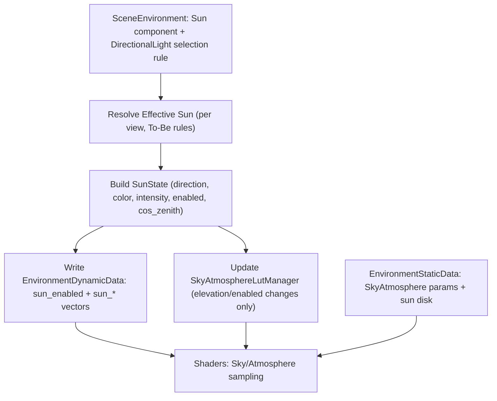

# Oxygen Environment - The Sun in Detail

## Purpose

Define the sun as a first-class environment system with clear ownership, authored parameters, and renderer-driven integration. The sun must remain compatible with scenes that only provide directional lights, while enabling explicit artistic control and consistent atmospheric rendering.

## Scope

- Scene-global, authored parameters only (no GPU resources stored in the component).
- Compatible with existing directional lights and renderer dynamic data.
- Works with sky atmosphere, sky background, fog, clouds, and IBL without hidden overrides.

## Design Goals (To‑Be)

1. **First‑class environment system**: The sun is authored as an environment component.
2. **Deterministic resolution**: The renderer resolves one effective sun per view using a single, explicit rule order.
3. **Separation of concerns**: The sun owns its intrinsic properties; other systems may scale their *usage* of the sun but never rewrite the sun itself.
4. **Clear data split**: Per‑view sun data goes to the dynamic CBV; authored atmosphere/sky data goes to static data.

## Sun Component Overview

### Component Name

**Sun** (environment system component).

### Intrinsic Properties (Authored) — To‑Be Contract

These define the physical/artist-intended sun. They are the authoritative values that other systems can only modulate via multipliers.

- **Sun Source**
  - `mode`: Synthetic | FromScene (default)
  - `light_reference`: Optional reference to a scene directional light node
  - **DirectionalLight selection rule** (when `light_reference` is not set and
    `mode == FromScene`):
    pick the first enabled `DirectionalLight` with `IsSunLight()==true`; if
    none, fall back to the first enabled directional light in the scene. See
    [src/Oxygen/Scene/Light/DirectionalLight.h](src/Oxygen/Scene/Light/DirectionalLight.h)
    for `DirectionalLight::SetIsSunLight()` and `DirectionalLight::IsSunLight()`.
- **Direction**
  - `direction_ws`: Normalized world-space direction toward the sun (Z‑up)
  - `azimuth_deg`, `elevation_deg`: UI‑friendly representation
  - **Contract**: `direction_ws` and `azimuth_deg`/`elevation_deg` are always
    mutually consistent, even when derived from a light.
- **Spectral**
  - `color_rgb`: Linear RGB (not premultiplied by intensity)
  - `intensity`: Illuminance in **lux** (authoring unit)
- **Angular Size**
  - `disk_angular_radius_rad`: For sun disk rendering in the sky shader
- **Enabled**
  - `enabled`: On/off for all sun contributions
- **Shadowing Policy**
  - If `light_reference` is set, shadowing comes from
    `DirectionalLight::Common().casts_shadows` in
    [src/Oxygen/Scene/Light/LightCommon.h](src/Oxygen/Scene/Light/LightCommon.h).
  - If the sun is synthesized, use the Sun’s own `casts_shadows` flag.
- **Light Temperature**
  - `temperature_kelvin` (optional). If set, convert to **linear RGB** and use
    it as `color_rgb`. If not set, use authored `color_rgb`.
  - Do not combine temperature and a separate `color_rgb` tint.

## Interaction With Other Environment Systems (To‑Be)

These systems may **consume** sun parameters and **apply multipliers**, but must
not overwrite intrinsic values.

### SkyAtmosphere

- Uses `direction_ws`, `color_rgb`, `intensity`, and `disk_angular_radius_rad`.
- Sun disk rendering uses `disk_angular_radius_rad` and atmospheric transmittance.
- Atmosphere applies an **aerial perspective strength** multiplier to the
  sun’s light when shading distant geometry. This scales atmospheric scattering
  only; it does not change the sun’s intrinsic properties.

### SkyLight (IBL)

- Uses the sun when capturing the sky into IBL.
- Allowed modifiers (non‑destructive), each multiplies a **sun intrinsic**:
  - `sun_intensity_multiplier` multiplies the sun’s `intensity` (lux).
  - `sun_color_multiplier_rgb` multiplies the sun’s `color_rgb` per channel
    (r·mr, g·mg, b·mb).
- SkyLight never rewrites the sun; it only scales the IBL contribution.

### Fog

- Uses sun direction and luminance for in-scattering and phase response.
- Fog uses sun direction/luminance for scattering but does not modify the sun’s
  intrinsic `color_rgb` or `intensity`.

### VolumetricClouds

- Uses sun direction and luminance for lighting and shadows.
- Cloud density/phase controls how much sunlight scatters through clouds, but
  does not modify the sun’s intrinsic `color_rgb` or `intensity`.

### PostProcess

- Auto exposure may use sun luminance as a contributor to scene key.
- Tonemapping maps output only; it does not change sun parameters.

## Renderer Integration

### Effective Sun Resolution (To‑Be)

The renderer must resolve exactly one **effective sun** per view using the
authoring contract below. This is the authoritative order and must be
consistent across tools and runtime.

1. **If a `Sun` component exists and is enabled:**
   - **Synthetic mode**: use authored `direction_ws` (or
     `azimuth_deg`/`elevation_deg`) and the authored intrinsic values
     `color_rgb`, `intensity`, `disk_angular_radius_rad`, `casts_shadows`, and
     optional `temperature_kelvin`.
   - **FromScene mode**:
     - If `light_reference` is set, use that `DirectionalLight`.
     - If `light_reference` is not set, select the first enabled
       `DirectionalLight` where `IsSunLight()==true`, then fall back to the
       first enabled `DirectionalLight`.
     - Reference: [src/Oxygen/Scene/Light/DirectionalLight.h](src/Oxygen/Scene/Light/DirectionalLight.h).
   - **Contract**: `direction_ws` and `azimuth_deg`/`elevation_deg` stay
     consistent.

2. **If no `Sun` component exists:**
   - Use the same directional light selection rule as above.
   - If no directional light exists, use the engine default sun constants.

3. **Shadowing rule:**
   - If `light_reference` is used, shadowing comes from
     `DirectionalLight::Common().casts_shadows`.
   - If synthesized, use the Sun’s `casts_shadows` value.

4. **Temperature rule:**
   - If `temperature_kelvin` is set, it defines `color_rgb`.
   - Otherwise, use authored `color_rgb` or the referenced light’s color.

### Dynamic Buffer Payload (To‑Be)

The renderer publishes a **per‑view** sun payload in the environment dynamic
CBV. The **To‑Be spec** for the sun fields is identical on CPU and HLSL.
See [src/Oxygen/Renderer/Types/EnvironmentDynamicData.h](src/Oxygen/Renderer/Types/EnvironmentDynamicData.h)
and [src/Oxygen/Graphics/Direct3D12/Shaders/Renderer/EnvironmentDynamicData.hlsli](src/Oxygen/Graphics/Direct3D12/Shaders/Renderer/EnvironmentDynamicData.hlsli).

**Authoritative principle (To‑Be):**

- The To‑Be layout below is the **only** truth. Do not keep or preserve legacy
  sun fields for backward compatibility.
- Only sun fields are specified here. All non‑sun fields in the dynamic CBV
  remain as‑is and are out of scope for this document.

**CPU struct — Sun fields (To‑Be):**

- `uint32_t sun_enabled` — single authoritative enable flag.
- `glm::vec4 sun_direction_ws_illuminance` — xyz = direction toward sun,
  w = illuminance proxy.
- `glm::vec4 sun_color_rgb_intensity` — xyz = linear RGB, w = intensity (lux).
- `glm::vec4 override_sun_direction_ws_illuminance` — debug override only.
- `glm::uvec4 override_sun_flags` — debug override enable flag only.
- `glm::vec4 override_sun_color_rgb_intensity` — debug override only.

**HLSL struct — Sun fields (To‑Be):**

- `uint sun_enabled` — same meaning as CPU.
- `float4 sun_direction_ws_illuminance` — xyz = direction, w = illuminance.
- `float4 sun_color_rgb_intensity` — xyz = linear RGB, w = intensity.
- `float4 override_sun_direction_ws_illuminance` — debug override only.
- `uint4 override_sun_flags` — debug override enable flag only.
- `float4 override_sun_color_rgb_intensity` — debug override only.

**Sun → SunState → CBV mapping (To‑Be):**

- `enabled` → `SunState.enabled` → `sun_enabled`.
- `direction_ws` (or `azimuth_deg`/`elevation_deg`) →
  `SunState.direction_ws` → `sun_direction_ws_illuminance.xyz`.
- `color_rgb` (after optional `temperature_kelvin` conversion) →
  `SunState.color_rgb` → `sun_color_rgb_intensity.xyz`.
- `intensity` (lux) → `SunState.intensity` → `sun_color_rgb_intensity.w`.
- `illuminance` (derived from `color_rgb` + `intensity`) →
  `SunState.illuminance` → `sun_direction_ws_illuminance.w`.

**What is NOT in the sun CBV (To‑Be):**

- `disk_angular_radius_rad` and `sun_disk_enabled` live in
  `GpuSkyAtmosphereParams` within EnvironmentStaticData
  ([src/Oxygen/Renderer/Types/EnvironmentStaticData.h](src/Oxygen/Renderer/Types/EnvironmentStaticData.h)).
- `casts_shadows` is consumed by the lighting/shadow pipeline, not the sun CBV.

### LUT Regeneration Policy

- **Authoritative rule (To‑Be):** regenerate sky‑view LUTs only when the sun’s
  **elevation changes** or the sun **enable state changes**. Azimuth‑only
  changes do not trigger regeneration.
- **Grounding in code:** this matches the intent of
  `SkyAtmosphereLutManager::UpdateSunState()` which checks
  `SunState::ElevationDiffers()` and `enabled` and marks the LUTs dirty when
  either changes. See
  [src/Oxygen/Renderer/Internal/SkyAtmosphereLutManager.h](src/Oxygen/Renderer/Internal/SkyAtmosphereLutManager.h)
  and [src/Oxygen/Renderer/Internal/SkyAtmosphereLutManager.cpp](src/Oxygen/Renderer/Internal/SkyAtmosphereLutManager.cpp).
- `SunState::ElevationDiffers()` is defined in
  [src/Oxygen/Renderer/Types/SunState.h](src/Oxygen/Renderer/Types/SunState.h)
  and uses `cos_zenith` (derived from sun direction).

### Data Flow Summary (To‑Be)



**Step‑by‑step (To‑Be):**

1. Resolve the effective sun for the view (rules in Effective Sun Resolution).
2. Build `SunState` from the resolved sun.
3. Populate the dynamic CBV sun fields (`sun_enabled`, `sun_direction_ws_illuminance`,
   `sun_color_rgb_intensity`).
4. Update LUTs only when elevation/enabled changes (see LUT policy).
5. Shaders sample dynamic CBV + static environment data for sky/atmosphere.

## API Surface (Proposed)

### Class Name and Location

- `oxygen::scene::environment::Sun` (final)
- Header: [src/Oxygen/Scene/Environment/Sun.h](src/Oxygen/Scene/Environment/Sun.h)
- Base class: `EnvironmentSystem` in
  [src/Oxygen/Scene/Environment/EnvironmentSystem.h](src/Oxygen/Scene/Environment/EnvironmentSystem.h)
- Registration: `OXYGEN_COMPONENT(Sun)` (same pattern as
  `SkyAtmosphere`, `SkyLight`, `Fog`)

### SceneEnvironment Integration

The sun is hosted by `SceneEnvironment` like any other environment system.
Access follows the existing composition APIs in
[src/Oxygen/Scene/Environment/SceneEnvironment.h](src/Oxygen/Scene/Environment/SceneEnvironment.h):

- `AddSystem<Sun>(...)`
- `TryGetSystem<Sun>()` (returns `observer_ptr<Sun>` / `observer_ptr<const Sun>`)
- `RemoveSystem<Sun>()`
- `ReplaceSystem<Sun>(...)`

### Sun Component API (Scene Environment)

The API mirrors the style of existing environment systems: explicit setters,
const getters, no ownership of external objects, and minimal state.

- **Enabled (inherited)**: `SetEnabled(bool)` / `IsEnabled()`
- **Sun source**: `SetSunSource(SunSource)` / `GetSunSource()`
- **Direction (world space)**: `SetDirectionWs(const Vec3&)` /
  `GetDirectionWs()`
- **Azimuth/Elevation (degrees)**: `SetAzimuthElevationDegrees(float az_deg,
  float el_deg)` / `GetAzimuthDegrees()` / `GetElevationDegrees()`
- **Color (linear RGB)**: `SetColorRgb(const Vec3&)` / `GetColorRgb()`
- **Intensity (lux)**: `SetIntensityLux(float)` / `GetIntensityLux()`
- **Sun disk size**: `SetDiskAngularRadiusRadians(float)` /
  `GetDiskAngularRadiusRadians()`
- **Shadowing** (only used when no light is referenced):
  `SetCastsShadows(bool)` / `CastsShadows()`
- **Light temperature**: `SetLightTemperatureKelvin(float)` /
  `GetLightTemperatureKelvin()` / `HasLightTemperature()` /
  `ClearLightTemperature()`
- **Directional light reference** (SceneNode):
  `SetLightReference(const scene::SceneNode&)` / `GetLightReference()` /
  `ClearLightReference()`
  - The reference must identify a node that owns a `DirectionalLight`.
  - **Resolve** is performed by the renderer in
    `Renderer::RunScenePrep()` during the **view‑phase** when it prepares
    per‑view dynamic data. This resolution is **view‑specific** (one per
    `view_id`). In that step, the renderer determines the **effective sun**
    using the rules in *Effective Sun Resolution (To‑Be)* and writes the
    per‑view `SunState` via
    `EnvironmentDynamicDataManager::SetSunState(view_id, sun)`. See
    [src/Oxygen/Renderer/Renderer.cpp](src/Oxygen/Renderer/Renderer.cpp) and
    [src/Oxygen/Renderer/Internal/EnvironmentDynamicDataManager.h](src/Oxygen/Renderer/Internal/EnvironmentDynamicDataManager.h).
  - During each resolve, the reference is treated as **invalid** when
    `SceneNode::IsAlive()` is false. This is a built‑in liveness check that
    verifies the node handle is valid, the owning `Scene` still exists, and
    that the node is still contained by that scene. See
    [src/Oxygen/Scene/SceneNode.h](src/Oxygen/Scene/SceneNode.h) and
    [src/Oxygen/Scene/SceneNode.cpp](src/Oxygen/Scene/SceneNode.cpp).
  - If the node is alive but does not currently contain a `DirectionalLight`
    component, clear the reference and fall back to the synthetic sun path.

#### SunSource (enum class)

- `kSynthetic` — use authored sun values; skip scene light resolution.
- `kFromScene` — resolve from the scene (using `light_reference` or the
  selection rule) with fallback; this is the default.

### Renderer Integration (Internal)

- `EnvironmentDynamicDataManager::SetSunState(view_id, SunState)`

**Debug sun override decision:**

Remove the public debug override API. The sun is now fully authorable as a
scene environment system (explicit mode) or bound to a directional light, so a
renderer‑level override would introduce a second, divergent resolution path.
That would bypass the deterministic selection rules, complicate LUT invalidation
(`SkyAtmosphereLutManager::UpdateSunState()`), and create mismatches between
scene state and renderer state. For debugging, a temporary `Sun` component or a
test directional light exercises the exact runtime path and keeps tooling aligned
with production behavior. If a developer‑only override is ever needed, it should
remain an internal tool with no public API surface.

## Data Ownership and Constraints

- The sun component stores authored parameters only.
- The renderer is responsible for:
  - selecting the effective sun
  - deriving final luminance and direction
  - sending data to GPU
- No environment system should hard-override sun intrinsic values.

## Compatibility Notes

- Scenes without a `Sun` component still work by selecting a directional light.
- When a `Sun` component is present, it can resolve **FromScene** or remain
  **Synthetic** (authored), per `SunSource`.
- Directional light tagging uses `DirectionalLight::SetIsSunLight()` and
  `DirectionalLight::IsSunLight()` in
  [src/Oxygen/Scene/Light/DirectionalLight.h](src/Oxygen/Scene/Light/DirectionalLight.h).
- Existing directional lights continue to function for lighting and shadows.

## Comparison With Leading Engines

The table summarizes common patterns across mainstream engines and how the proposed design aligns.

| Engine | Sun Representation | Sky/Atmosphere Sun Link | Default Behavior |
| --- | --- | --- | --- |
| Unreal Engine | Directional Light + SkyAtmosphere Sun Index | Explicit link from atmosphere to directional light | Uses first linked directional light |
| Unity (HDRP) | Directional Light + Physically Based Sky | Explicit sun assignment | Uses main directional light |
| Unity (URP) | Main Light (directional) + Skybox | Implicit main light | Uses brightest directional |
| Godot | Directional Light + Sky | Explicit by scene setup | Uses configured directional light |
| Frostbite / Custom AAA | Directional Light tagged as sun | Explicit tag or role | Fallback to first directional |
| Oxygen (To‑Be) | Sun component (SunSource: FromScene or Synthetic) | Sun resolves per view; atmosphere uses resolved sun | FromScene by default, with explicit light reference or tagged fallback |

## Notes on Shader Integration

### Impacted Shaders and Helpers (To‑Be)

- Environment dynamic sun payload and accessors:
  [src/Oxygen/Graphics/Direct3D12/Shaders/Renderer/EnvironmentDynamicData.hlsli](src/Oxygen/Graphics/Direct3D12/Shaders/Renderer/EnvironmentDynamicData.hlsli)
  (`GetSunDirectionWS()`, `GetSunLuminanceRGB()`, override flags).
- Atmosphere static params (sun disk controls):
  [src/Oxygen/Graphics/Direct3D12/Shaders/Renderer/EnvironmentStaticData.hlsli](src/Oxygen/Graphics/Direct3D12/Shaders/Renderer/EnvironmentStaticData.hlsli)
  (`sun_disk_angular_radius_radians`, `sun_disk_enabled`).
- Sky LUT sampling and sun disk evaluation:
  [src/Oxygen/Graphics/Direct3D12/Shaders/Renderer/SkyAtmosphereSampling.hlsli](src/Oxygen/Graphics/Direct3D12/Shaders/Renderer/SkyAtmosphereSampling.hlsli)
  (sun‑relative sky‑view LUT UVs, `ComputeSunDisk()` with horizon clipping).
- Sky‑view LUT generation (sun‑relative parameterization, multi‑scattering
  approximation):
  [src/Oxygen/Graphics/Direct3D12/Shaders/Passes/Atmosphere/SkyViewLut_CS.hlsl](src/Oxygen/Graphics/Direct3D12/Shaders/Passes/Atmosphere/SkyViewLut_CS.hlsl).
- Sky rendering and IBL capture:
  [src/Oxygen/Graphics/Direct3D12/Shaders/Passes/Sky/SkySphereCommon.hlsli](src/Oxygen/Graphics/Direct3D12/Shaders/Passes/Sky/SkySphereCommon.hlsli),
  [src/Oxygen/Graphics/Direct3D12/Shaders/Passes/Sky/SkySphere_PS.hlsl](src/Oxygen/Graphics/Direct3D12/Shaders/Passes/Sky/SkySphere_PS.hlsl),
  [src/Oxygen/Graphics/Direct3D12/Shaders/Passes/Sky/SkyCapture_PS.hlsl](src/Oxygen/Graphics/Direct3D12/Shaders/Passes/Sky/SkyCapture_PS.hlsl).
- Aerial perspective applied to geometry (uses sun direction/luminance + LUTs
  with analytic fallback):
  [src/Oxygen/Graphics/Direct3D12/Shaders/Renderer/AerialPerspective.hlsli](src/Oxygen/Graphics/Direct3D12/Shaders/Renderer/AerialPerspective.hlsli).

### Techniques Used (To‑Be)

- **Sky‑view LUT** raymarching with sun‑relative azimuth parameterization
  (LUT is stable under azimuth changes; regen only on elevation change).
- **Transmittance LUT** + **Beer‑Lambert** attenuation for sun visibility.
- **Multiple scattering approximation** in LUT generation to avoid dark skies
  at $90^\circ$ from the sun.
- **Analytic sun disk** in `ComputeSunDisk()` with soft edge + horizon fade.
- **Aerial perspective** from LUT sampling with an analytic fallback path.

### Alternatives (Not in current code)

- **Full per‑pixel raymarch** for sky/atmosphere (higher quality, much higher
  cost).
- **Pure analytic sky gradient** or **cubemap‑only** sky (cheaper, less
  physically grounded).
- **Separate multi‑scattering LUT** (higher fidelity at extra memory/compute
  cost).

### Gap With Current Code (To‑Be vs Now)

- Renderer currently resolves the sun from `LightManager` directional lights in
  `Renderer::RunScenePrep()` and does not consume the `Sun` component yet. See
  [src/Oxygen/Renderer/Renderer.cpp](src/Oxygen/Renderer/Renderer.cpp).
- Debug override sun is still present in `EnvironmentDynamicData` and used by
  shaders (`override_sun_*`, `ATMOSPHERE_OVERRIDE_SUN`). See
  [src/Oxygen/Graphics/Direct3D12/Shaders/Renderer/EnvironmentDynamicData.hlsli](src/Oxygen/Graphics/Direct3D12/Shaders/Renderer/EnvironmentDynamicData.hlsli)
  and [src/Oxygen/Graphics/Direct3D12/Shaders/Renderer/AerialPerspective.hlsli](src/Oxygen/Graphics/Direct3D12/Shaders/Renderer/AerialPerspective.hlsli).
- Dynamic payload now uses the To‑Be `sun_enabled` contract
  contract.

## Light Temperature to RGB Conversion

### Overview

The Sun component supports optional `temperature_kelvin` for physically-based sun color authoring. This section evaluates conversion techniques and provides implementation guidance.

### Conversion Techniques

#### 1. Mitchell Charity Blackbody Table

**Description**: Lookup table derived from Planck's law integrated over CIE color matching functions, covering 1000K-40000K in 100K steps.

**Pros**:

- Physically accurate (true blackbody spectrum)
- Reference standard used in astronomy and color science
- Well-documented and validated

**Cons**:

- Requires lookup table storage (~800 bytes for full range)
- Needs interpolation between table entries
- Not commonly used in game engines (less precedent)

**References**: Mitchell Charity's blackbody color table (<http://www.vendian.org/mncharity/dir3/blackbody/>)

#### 2. Tanner Helland Polynomial Approximation

**Description**: Piecewise polynomial fits to Charity's blackbody table, optimized for 1000K-40000K range.

**Algorithm**:

```cpp
// Temperature ranges and polynomial coefficients
// Red: constant 255 for T >= 6600K; polynomial for T < 6600K
// Green: piecewise polynomials for T < 6600K and T >= 6600K
// Blue: constant 255 for T >= 6600K; polynomial for T < 6600K
```

**Pros**:

- Fast: simple polynomial evaluation (no table lookups)
- Compact: ~10 lines of code
- Accurate: max error < 1% vs. reference table
- Industry precedent: used in photo editing tools

**Cons**:

- Approximation (not exact Planckian curve)
- Tuned to specific temperature range

**References**: Tanner Helland, "How to Convert Temperature (K) to RGB" (2012)

#### 3. CIE Daylight Illuminant D Series

**Description**: CIE standard daylight illuminants with correlated color temperature (CCT).

**Pros**:

- Industry standard for daylight simulation
- Accounts for atmospheric scattering (blue sky contribution)
- Used in color science and calibration

**Cons**:

- More complex: requires spectral data + integration
- Overkill for real-time rendering
- Limited to daylight range (4000K-25000K effective)

**References**: CIE Technical Report 15:2004

#### 4. Neil Bartlett Simplified Algorithm

**Description**: Simplified version of Tanner Helland's approach with fewer branches.

**Pros**:

- Minimal code
- Good visual results

**Cons**:

- Less accurate at extremes
- Less documentation/validation

**References**: Neil Bartlett GitHub implementation (2014)

### Engine Precedents

| Engine | Technique | Notes |
| ------ | --------- | ----- |
| Unreal Engine 5 | Polynomial approximation (similar to Tanner Helland) | Fast, artist-friendly |
| Unity HDRP | CIE-based or approximation (undocumented) | Physically-based workflow |
| Frostbite | Assumed polynomial or LUT | Real-time performance critical |
| Arnold (offline) | True Planckian blackbody + CIE | Accuracy over performance |

### Recommended Implementation

**Primary**: **Tanner Helland Polynomial Approximation**

**Justification**:

1. **Performance**: O(1) polynomial evaluation, no memory overhead, GPU-friendly
2. **Accuracy**: < 1% error vs. reference within artist-relevant range (2000K-10000K)
3. **Precedent**: Proven in game engines (UE5) and photo tools
4. **Simplicity**: Minimal code, easy to debug and tune
5. **Range**: Covers all practical sun temperatures (sunrise ~2000K to noon ~6500K to "alien sun" ~10000K)

**Fallback/Alternative**: **Mitchell Charity Blackbody LUT**

**Use case**: If future requirements demand exact Planckian curves (e.g., scientific visualization or HDR calibration workflows).

**Implementation**: Store 128-entry LUT (1000K-40000K, 305K steps) + linear interpolation. Total cost: ~1.5KB + trivial lookup.

### Implementation Details

**Function signature** (internal helper in Sun.cpp):

```cpp
// In Sun.cpp, anonymous namespace
namespace {
  auto KelvinToLinearRgb(float kelvin) -> glm::vec3;
}
```

**Range handling**:

- Clamp input to 1000K-40000K
- Below 1000K: red-only (ember glow)
- Above 40000K: blue-white (hot stars)

**Normalization**:

- Return normalized RGB (max component = 1.0)
- Intensity scaling handled separately via `intensity_lux_` parameter

**Tanner Helland algorithm** (reference implementation for Sun.cpp):

```cpp
// Place in anonymous namespace at top of Sun.cpp
namespace {

auto KelvinToLinearRgb(float kelvin) -> glm::vec3 {
  // Clamp to valid range
  kelvin = glm::clamp(kelvin, 1000.0F, 40000.0F);

  // Normalize to 0-100 range for calculation
  const float temp = kelvin / 100.0F;

  float r, g, b;

  // Red
  if (temp <= 66.0F) {
    r = 255.0F;
  } else {
    r = temp - 60.0F;
    r = 329.698727446F * std::pow(r, -0.1332047592F);
    r = glm::clamp(r, 0.0F, 255.0F);
  }

  // Green
  if (temp <= 66.0F) {
    g = temp;
    g = 99.4708025861F * std::log(g) - 161.1195681661F;
    g = glm::clamp(g, 0.0F, 255.0F);
  } else {
    g = temp - 60.0F;
    g = 288.1221695283F * std::pow(g, -0.0755148492F);
    g = glm::clamp(g, 0.0F, 255.0F);
  }

  // Blue
  if (temp >= 66.0F) {
    b = 255.0F;
  } else if (temp <= 19.0F) {
    b = 0.0F;
  } else {
    b = temp - 10.0F;
    b = 138.5177312231F * std::log(b) - 305.0447927307F;
    b = glm::clamp(b, 0.0F, 255.0F);
  }

  // Normalize to [0, 1] and return as linear RGB
  glm::vec3 rgb(r / 255.0F, g / 255.0F, b / 255.0F);

  // Normalize so max component = 1.0
  const float max_component = glm::max(glm::max(rgb.r, rgb.g), rgb.b);
  if (max_component > 0.0F) {
    rgb /= max_component;
  }

  return rgb;
}

} // anonymous namespace
```

**Testing strategy**:

- Unit tests for key temperatures: 2000K (sunrise), 5500K (daylight), 6500K (noon), 10000K (overcast)
- Visual validation in EnvironmentDebugPanel with temperature slider + RGB preview
- Compare against reference images/tables

**Future extensions**:

- Optional Mitchell Charity LUT path for exact Planckian curves (controlled by build flag or runtime toggle)
- Exposure to HLSL for GPU-side temperature conversion (if IBL capture needs dynamic temperature)

## Implementation Plan

### Phase 1: Component, Types, and Integration

#### Task 1.1: Create Sun component class

- [X] File: [src/Oxygen/Scene/Environment/Sun.h](src/Oxygen/Scene/Environment/Sun.h)
- [X] File: [src/Oxygen/Scene/Environment/Sun.cpp](src/Oxygen/Scene/Environment/Sun.cpp)
- [X] Derive from `EnvironmentSystem`
- [X] Implement `SunSource` enum class with `kSynthetic`, `kFromScene` values
- [X] Add members: `sun_source_`, `light_reference_` (SceneNode), `direction_ws_`, `azimuth_deg_`, `elevation_deg_`, `color_rgb_`, `intensity_lux_`, `disk_angular_radius_rad_`, `casts_shadows_`, `temperature_kelvin_` (`std::optional<float>`)
- [X] Implement API: `SetSunSource()`, `GetSunSource()`, `SetDirectionWs()`, `GetDirectionWs()`, `SetAzimuthElevationDegrees()`, `GetAzimuthDegrees()`, `GetElevationDegrees()`, `SetColorRgb()`, `GetColorRgb()`, `SetIntensityLux()`, `GetIntensityLux()`, `SetDiskAngularRadiusRadians()`, `GetDiskAngularRadiusRadians()`, `SetCastsShadows()`, `CastsShadows()`, `SetLightTemperatureKelvin()`, `GetLightTemperatureKelvin()`, `HasLightTemperature()`, `ClearLightTemperature()`, `SetLightReference()`, `GetLightReference()`, `ClearLightReference()`
- [X] **Caching strategy**: `color_rgb_` always stores the active color (either set directly or computed from temperature). `SetLightTemperatureKelvin(kelvin)` calls `KelvinToLinearRgb(kelvin)` once and caches result in `color_rgb_`, then stores kelvin in `temperature_kelvin_`. `SetColorRgb(color)` stores color and clears `temperature_kelvin_`. `GetColorRgb()` returns cached `color_rgb_`.
- [X] Maintain mutual consistency between `direction_ws_` and `azimuth_deg_`/`elevation_deg_` via internal helper functions `DirectionToAzimuthElevation()` and `AzimuthElevationToDirection()`
- [X] Default: `sun_source_ = kFromScene`, `direction_ws_ = {0, 0.866, 0.5}` (30° elevation), `color_rgb_ = {1,1,1}`, `intensity_lux_ = 100000.0`, `disk_angular_radius_rad_ = 0.004675`, `casts_shadows_ = true`, `temperature_kelvin_ = std::nullopt`
- [X] Register with `OXYGEN_COMPONENT(Sun)` macro

#### Task 1.2: Add azimuth/elevation conversion utilities

- [X] File: [src/Oxygen/Scene/Environment/Sun.cpp](src/Oxygen/Scene/Environment/Sun.cpp)
- [X] Implement `DirectionToAzimuthElevation(const glm::vec3& dir) -> std::pair<float, float>` (Z-up convention: azimuth 0°=+X, 90°=+Y; elevation 0°=horizon, 90°=zenith)
- [X] Implement `AzimuthElevationToDirection(float az_deg, float el_deg) -> glm::vec3` (returns normalized direction)
- [X] Use `std::atan2`, `std::asin`, `glm::cos`, `glm::sin` with degree-to-radian conversions

#### Task 1.3: Update EnvironmentDynamicData struct (CPU)

- [X] File: [src/Oxygen/Renderer/Types/EnvironmentDynamicData.h](src/Oxygen/Renderer/Types/EnvironmentDynamicData.h)
- [X] Replace `uint32_t sun_valid` with `uint32_t sun_enabled`
- [X] Verify layout: `sun_enabled`, `sun_direction_ws_illuminance`, `sun_color_rgb_intensity`, `override_sun_direction_ws_illuminance`, `override_sun_flags`, `override_sun_color_rgb_intensity`
- [X] Update comments to match To-Be contract
- [X] Update `static_assert` offset checks for new layout
- [X] Keep debug override fields but mark as internal-only in comments

#### Task 1.4: Update EnvironmentDynamicData.hlsli (GPU)

- [X] File: [src/Oxygen/Graphics/Direct3D12/Shaders/Renderer/EnvironmentDynamicData.hlsli](src/Oxygen/Graphics/Direct3D12/Shaders/Renderer/EnvironmentDynamicData.hlsli)
- [X] Replace `uint sun_valid` with `uint sun_enabled`
- [X] Update helper function: `HasSunLight()` → check `sun_enabled` instead of `sun_valid`
- [X] Add comments matching To-Be contract
- [X] Keep debug override fields and `GetSunDirectionWS()` override logic (ATMOSPHERE_OVERRIDE_SUN flag)

#### Task 1.5: Extend SunState factory methods

- [X] File: [src/Oxygen/Renderer/Types/SunState.h](src/Oxygen/Renderer/Types/SunState.h)
- [X] Existing: `FromDirectionAndLight()`, `FromAzimuthElevation()`
- [X] Verify these support the `enabled` parameter (already present)
- [X] No changes needed; SunState already supports all required fields

#### Task 1.6: Add temperature-to-RGB conversion utility

- [X] File: [src/Oxygen/Scene/Environment/Sun.cpp](src/Oxygen/Scene/Environment/Sun.cpp)
- [X] Implement `KelvinToLinearRgb(float kelvin) -> glm::vec3` in anonymous namespace as internal helper
- [X] Use **Tanner Helland polynomial approximation** (algorithm detailed in "Light Temperature to RGB Conversion" section)
- [X] Range: 1000K-40000K (clamped)
- [X] Returns normalized linear RGB (max component = 1.0)
- [X] **Called once** by `Sun::SetLightTemperatureKelvin(kelvin)` to compute and cache color in `color_rgb_` member. `GetColorRgb()` returns the cached value without recomputation.
- [X] `SetColorRgb(color)` directly sets `color_rgb_` and clears `temperature_kelvin_` (mutually exclusive per spec)
- [X] Add unit tests for key temperatures: 2000K, 5500K, 6500K, 10000K

#### Task 1.7: Implement sun resolution logic in Renderer

- [X] File: [src/Oxygen/Renderer/Renderer.cpp](src/Oxygen/Renderer/Renderer.cpp)
- [X] Modify `Renderer::RunScenePrep()` in the view-phase section (around line 1009)
- [X] Replace `SelectSunLight()` call with new `ResolveSunForView()` function
- [X] Resolution order:
  1. Check `SceneEnvironment::TryGetSystem<Sun>()`
  2. If Sun exists and enabled:
     - If `sun_source_ == kSynthetic`: use authored values
     - If `sun_source_ == kFromScene`:
       - If `light_reference_` is set and `IsAlive()` and has `DirectionalLight`: use that light
       - Else: `SelectSunLight()` with `IsSunLight()` priority
  3. If no Sun or Sun disabled: `SelectSunLight()` fallback
  4. If no light: use `kNoSun` (engine default)
- [X] Build `SunState` from resolved sun (apply temperature conversion if needed)
- [X] Call `env_dynamic_manager_->SetSunState(view_id, sun_state)`

#### Task 1.8: Update EnvironmentDynamicDataManager::SetSunState()

- [X] File: [src/Oxygen/Renderer/Internal/EnvironmentDynamicDataManager.cpp](src/Oxygen/Renderer/Internal/EnvironmentDynamicDataManager.cpp)
- [X] Modify to populate `sun_enabled` (from `SunState.enabled`)
- [X] Populate `sun_direction_ws_illuminance` (xyz from `direction_ws`, w from `illuminance`)
- [X] Populate `sun_color_rgb_intensity` (xyz from `color_rgb`, w from `intensity`)
- [X] Mark view dirty for next `UpdateIfNeeded()`

#### Task 1.9: Remove or deprecate sun override public API

- [X] File: [src/Oxygen/Renderer/Renderer.h](src/Oxygen/Renderer/Renderer.h), [src/Oxygen/Renderer/Renderer.cpp](src/Oxygen/Renderer/Renderer.cpp)
- [X] Remove public `SetAtmosphereSunOverride()` method (if exists)
- [X] Keep internal `sun_override_` member for developer-only debug UI
- [X] Update comments: "Internal debug override only; no public API"
- [X] Keep `EnvironmentDynamicDataManager::SetAtmosphereSunOverride()` as internal API

#### Task 1.10: Populate GpuSkyAtmosphereParams sun disk from Sun component

- [X] File: [src/Oxygen/Renderer/Internal/EnvironmentStaticDataManager.cpp](src/Oxygen/Renderer/Internal/EnvironmentStaticDataManager.cpp)
- [X] Modify `EnvironmentStaticDataManager::PopulateAtmosphere()`
- [X] Sun disk radius is authored on `Sun` and forwarded into
  `GpuSkyAtmosphereParams` for rendering.

#### Task 1.11: Wire Sun component into SceneEnvironment

- [X] File: [src/Oxygen/Scene/CMakeLists.txt](src/Oxygen/Scene/CMakeLists.txt)
- [X] Add `Environment/Sun.h` and `Environment/Sun.cpp` to scene module sources
- [X] File: [src/Oxygen/Scene/Environment/README.md](src/Oxygen/Scene/Environment/README.md)
- [X] Document `Sun` as a first-class environment system
- [X] Test: Instantiate `Sun` in unit test and verify composition works

#### Task 1.12: Update LUT regeneration policy enforcement

- [X] File: [src/Oxygen/Renderer/Internal/SkyAtmosphereLutManager.cpp](src/Oxygen/Renderer/Internal/SkyAtmosphereLutManager.cpp)
- [X] Verify `UpdateSunState()` already checks `SunState::ElevationDiffers()` and `enabled` changes
- [X] Confirm `ElevationDiffers()` uses `cos_zenith` comparison (already implemented in `SunState.h`)
- [X] No changes expected; policy already matches spec

#### Task 1.13: Update Renderer.cpp sun override merge logic

- [X] File: [src/Oxygen/Renderer/Renderer.cpp](src/Oxygen/Renderer/Renderer.cpp)
- [X] Around line 1046-1050: `SunState effective_sun = sun_override_.enabled ? sun_override_ : scene_sun;`
- [X] Keep this logic for internal debug override
- [X] Ensure `sun_override_` does not bypass the new Sun component resolution

#### Task 1.14: Update shader accessors for sun_enabled

- [X] File: [src/Oxygen/Graphics/Direct3D12/Shaders/Renderer/EnvironmentDynamicData.hlsli](src/Oxygen/Graphics/Direct3D12/Shaders/Renderer/EnvironmentDynamicData.hlsli)
- [X] Update `HasSunLight()` to check `sun_enabled` (already covered in Task 1.4)
- [X] Review all callers of `HasSunLight()` in shaders (sky, atmosphere, aerial perspective)
- [X] No semantic changes expected

#### Task 1.15: Test sun resolution path with unit tests and fakes

- [X] Create unit tests for `ResolveSunForView()` function using fake/mock scene environments
- [X] Test case 1: No Sun component → verify fallback to `SelectSunLight()`
- [X] Test case 2: Sun component in Synthetic mode → verify authored values used
- [X] Test case 3: Sun component in FromScene mode with valid `light_reference` → verify reference used
- [X] Test case 4: Sun component in FromScene mode with invalid reference → verify fallback to synthetic sun
- [X] Test case 5: Sun component in FromScene mode without reference → verify `IsSunLight()` priority
- [X] Test case 6: `SceneNode::IsAlive()` returns false → verify fallback to light selection
- [ ] Manual integration testing: Load TexturedCube and RenderScene examples, verify sun behavior with visual inspection

#### Task 1.16: Verify shadowing policy integration

- [ ] Confirm `casts_shadows` flag from Sun or referenced DirectionalLight is consumed by shadow system
- [ ] Trace shadow map generation code (likely in `ShadowPass` or `LightManager`) to ensure it reads `DirectionalLight::Common().casts_shadows` when sun is FromScene
- [ ] Ensure Sun's `casts_shadows_` is used when sun is Synthetic (no implementation detail provided; assumes existing shadow pipeline reads light flags)

#### Task 1.17: Update TexturedCube example to use Sun component

- [X] File: [Examples/TexturedCube/SceneSetup.cpp](Examples/TexturedCube/SceneSetup.cpp)
- [X] Currently creates DirectionalLight at line 337
- [X] Add Sun component to SceneEnvironment in Synthetic mode with authored direction/color/intensity
- [ ] Optionally add Sun in FromScene mode referencing existing DirectionalLight
- [X] Update `TexturedCube::SetSunDirection()` to modify Sun component instead of light transform
- [X] Demonstrate azimuth/elevation API usage

#### Task 1.18: Update RenderScene example to use Sun component

- [X] File: [Examples/RenderScene/MainModule.cpp](Examples/RenderScene/MainModule.cpp)
- [X] Currently creates DirectionalLight at line 578
- [X] Add Sun component to SceneEnvironment for default scene
- [X] File: [Examples/DemoShell/UI/EnvironmentDebugPanel.cpp](Examples/DemoShell/UI/EnvironmentDebugPanel.cpp)
- [X] Add ImGui controls for Sun component (sun source mode, azimuth/elevation, color, intensity, temperature, disk radius)
- [X] Update existing sun direction controls to use Sun component API
- [X] Add UI toggle between Synthetic and FromScene modes
- [X] Add light temperature slider with Kelvin-to-RGB preview

### Known Limitations and Open Issues

- **Limitation 1 (Justified)**: Shadow pipeline integration for `casts_shadows` flag cannot be fully verified as shadowing is not yet implemented in the engine. When shadows are implemented, the shadow system must read `DirectionalLight::Common().casts_shadows` for FromScene mode and `Sun::CastsShadows()` for Synthetic mode.
