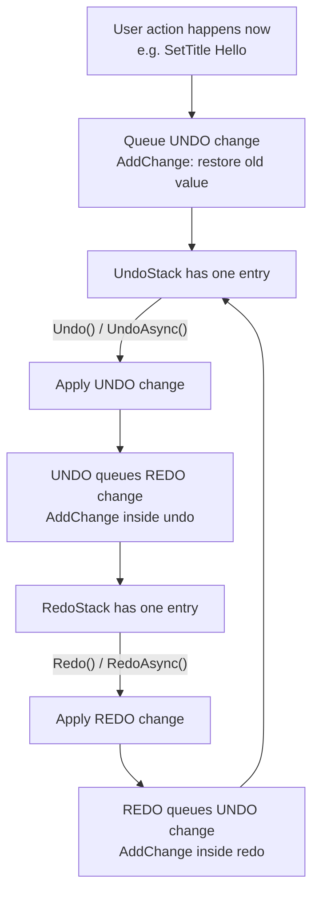

# TimeMachine

TimeMachine is a robust, composable undo/redo module for .NET applications. It is designed for complex scenarios including nested transactions, change sets, and (new) asynchronous change application.

## Highlights

- **Undo/Redo stacks per root** via `UndoRedo.Default[root]` (weak-keyed and GC-friendly)
- **Transactions** to group multiple changes into a single undo/redo entry
- **Change sets** to group changes produced during undo/redo of grouped operations
- **Async support**: changes can be applied synchronously or asynchronously

## Technology

- **Language:** C# 13 (preview)
- **Target frameworks:** .NET 9.0, .NET 9.0-windows10.0.26100.0
- **Testing:** MSTest + AwesomeAssertions (+ Moq)

## Concepts

### HistoryKeeper

`HistoryKeeper` manages the undo/redo history for one “root” object.

Key capabilities:

- Tracks `UndoStack` and `RedoStack`
- Clears redo history when new (non-undo/redo) changes are added
- Supports nested `ITransaction` blocks
- Supports change sets for atomic undo/redo of grouped operations

### Changes

Changes implement `IChange` and are the unit of undo/redo.

- `IChange.Apply()` is the synchronous execution path.
- `IChange.ApplyAsync(CancellationToken)` is the asynchronous execution path.

Async model:

- By default, `ApplyAsync(...)` calls `Apply()`.
- Async-only changes throw from `Apply()` to avoid accidental blocking/deadlocks.

### Transactions

Transactions (`ITransaction`) are also changes, allowing a transaction to be pushed as a single entry to the undo/redo stacks.

## Project Structure

```plaintext
projects/TimeMachine/
├── src/
│   ├── TimeMachine.csproj
│   ├── HistoryKeeper.cs
│   ├── UndoRedo.cs
│   ├── HistoryKeeperAddChangeExtensions.cs
│   ├── StateTransition`1.cs
│   ├── Changes/
│   │   ├── IChange.cs
│   │   ├── Change.cs
│   │   ├── ChangeSet.cs
│   │   ├── SimpleAction.cs
│   │   ├── ActionWithArgument`1.cs
│   │   ├── TargetedChange`1.cs
│   │   ├── LambdaExpressionOnTarget`1.cs
│   │   ├── AsyncSimpleAction.cs
│   │   ├── AsyncActionWithArgument`1.cs
│   │   └── AsyncLambdaExpressionOnTarget`1.cs
│   ├── Transactions/
│   │   ├── ITransaction.cs
│   │   ├── Transaction.cs
│   │   ├── ITransactionFactory.cs
│   │   └── ITransactionManager.cs
│   └── Properties/
├── tests/
│   ├── TimeMachine.Tests.csproj
│   ├── TimeMachine.Async.Tests/
│   │   ├── TimeMachine.Async.Tests.csproj
│   │   └── (async-only test suites)
│   └── (sync test suites)
└── README.md
```

## Getting Started

### Installation

```bash
dotnet add package DroidNet.TimeMachine
```

### Create a HistoryKeeper

```csharp
using DroidNet.TimeMachine;

var root = new object();
var historyKeeper = UndoRedo.Default[root];
```

### Mental model (undo/redo in one minute)

TimeMachine can feel “backwards” at first, especially if you are new to undo/redo.

The key idea:

- When the user performs an operation, you **do the operation now**.
- Immediately after that, you **queue the reverse operation** (the “undo”) using `AddChange(...)`.
- When an undo runs, it can (and usually should) **queue the reverse of the undo** (the “redo”).

So you are not telling TimeMachine “what I just did”. You are telling it “how to undo what I just did”.

Mermaid flow (what happens and when):



Example (sync):

```csharp
var value = 0;

void Increment()
{
    value++;

    // Queue the reverse operation.
    historyKeeper.AddChange("decrement", () =>
    {
        value--;

        // When undoing, register the redo operation.
        historyKeeper.AddChange("increment", Increment);
    });
}

Increment();

historyKeeper.Undo(); // value goes back
historyKeeper.Redo(); // value goes forward again
```

### Add synchronous changes

```csharp
var oldTitle = document.Title;
document.SetTitle("Hello");

// Queue the undo (set title back to the previous value).
historyKeeper.AddChange("set-title", document, d => d.SetTitle(oldTitle));

// You can also queue simple actions.
historyKeeper.AddChange("log", () => Console.WriteLine("Undo: restore previous state"));

// And actions that take arguments.
historyKeeper.AddChange("append", (string? s) => Console.WriteLine(s), "Undo message");
```

### Undo/Redo (synchronous)

```csharp
if (historyKeeper.CanUndo)
{
    historyKeeper.Undo();
}

if (historyKeeper.CanRedo)
{
    historyKeeper.Redo();
}
```

## Async Support

TimeMachine supports asynchronous changes end-to-end:

- `IChange.ApplyAsync(...)` exists on the core change contract.
- `HistoryKeeper.UndoAsync(...)` and `HistoryKeeper.RedoAsync(...)` are the async execution entry points.

### Add asynchronous changes (Task-based delegates)

The extension methods accept Task-returning delegates so `async` lambdas are unambiguous.

```csharp
using System.Threading.Tasks;

historyKeeper.AddChange("undo", async () =>
{
    await Task.Delay(50).ConfigureAwait(false);

    // When undoing, register the redo action.
    historyKeeper.AddChange("redo", async () =>
    {
        await Task.Delay(50).ConfigureAwait(false);
    });
});
```

### Undo/Redo (asynchronous)

```csharp
if (historyKeeper.CanUndo)
{
    await historyKeeper.UndoAsync().ConfigureAwait(false);
}

if (historyKeeper.CanRedo)
{
    await historyKeeper.RedoAsync().ConfigureAwait(false);
}
```

### Mixing synchronous and asynchronous changes

You can mix synchronous and asynchronous changes in the same history (including inside transactions and change sets).

Guidelines:

- **Mixing is allowed:** you can register sync and async changes together.
- **Async execution is superset:** synchronous changes are compatible with the async pipeline because the default `ApplyAsync(...)` delegates to `Apply()`.
- **Do not use `Undo()` / `Redo()` if async-only changes may exist:** async-only changes throw from `Apply()` to prevent accidental sync execution.

Practical rule of thumb:

- If a history may contain any async-only change, treat the whole history as async and always use `UndoAsync()` / `RedoAsync()`.

Example (mixed history, executed asynchronously):

```csharp
historyKeeper.AddChange("sync-log", () => Console.WriteLine("sync undo"));

historyKeeper.AddChange("async-undo", async () =>
{
    await Task.Delay(10).ConfigureAwait(false);
});

await historyKeeper.UndoAsync().ConfigureAwait(false);
```

## Transactions

Use transactions to group multiple changes into a single undo/redo entry.

```csharp
using (var transaction = historyKeeper.BeginTransaction("edit-document"))
{
    historyKeeper.AddChange("set-title", document, d => d.SetTitle("New"));
    historyKeeper.AddChange("set-author", document, d => d.SetAuthor("You"));
    transaction.Commit();
}
```

Nested transactions are supported.

## Change Sets

Change sets group changes into an atomic unit until `EndChangeSet()`.

```csharp
historyKeeper.BeginChangeSet("batch");
historyKeeper.AddChange("op1", obj1, o => o.Update());
historyKeeper.AddChange("op2", obj2, o => o.Refresh());
historyKeeper.EndChangeSet();
```

## Extending TimeMachine

### Custom change (sync)

```csharp
using DroidNet.TimeMachine.Changes;

public sealed class CustomChange : Change
{
    public required Action ApplyAction { get; init; }

    public override void Apply() => this.ApplyAction();
}
```

### Custom change (async)

```csharp
using System.Threading;
using System.Threading.Tasks;
using DroidNet.TimeMachine.Changes;

public sealed class CustomAsyncChange : Change
{
    public required Func<CancellationToken, ValueTask> ApplyActionAsync { get; init; }

    public override void Apply() => throw new InvalidOperationException("Use ApplyAsync for this change.");

    public override ValueTask ApplyAsync(CancellationToken cancellationToken = default) => this.ApplyActionAsync(cancellationToken);
}
```

## Testing

Run tests:

```bash
dotnet test -c Release --project projects/TimeMachine/tests/TimeMachine.Tests.csproj
```

## Build

```bash
dotnet build -c Release projects/TimeMachine/src/TimeMachine.csproj
```

## License

TimeMachine is distributed under the MIT License. See the repository root LICENSE file.
